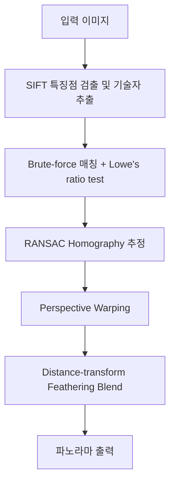
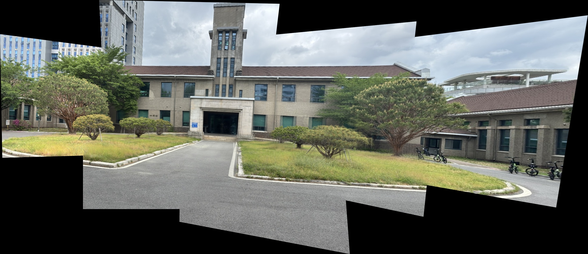

# ImageWeave

여러 장의 이미지를 자동으로 정합하여 하나의 파노라마 이미지를 생성하는 프로그램입니다.

## 기능

- **자동 특징점 검출** — SIFT 알고리즘으로 크기/회전에 강인한 특징점 추출
- **강인한 이미지 정합** — RANSAC 기반 Homography 추정으로 오매칭 제거
- **자연스러운 블렌딩** — Distance-transform feathering으로 이미지 경계선 제거
- 2장 이상의 이미지를 순차적으로 정합하여 하나의 넓은 파노라마 생성

## 동작 원리

## 잘 나오려면

- **겹침**: 인접한 이미지 간 약 30~50% 겹치는 영역이 있어야 합니다.
- **깊이**: 원경/근경의 깊이 차이가 크면 Homography 모델이 맞지 않을 수 있습니다.
- **노출**: 이미지 간 밝기를 일정하게 유지하면 경계가 더 자연스럽습니다.
- **순서**: 이미지를 왼쪽→오른쪽 순서로 이름 지정하세요.

## 추가 기능: Feathering Blend

겹치는 영역을 **Distance-transform 기반 feathering**으로 자연스럽게 블렌딩합니다.

- 겹치는 영역의 각 픽셀에서 이미지 가장자리까지의 거리를 계산
- 이미지 중심에 가까울수록 해당 이미지에 더 높은 가중치 부여
- 경계선 없이 부드러운 그라데이션 전환 효과

## 결과

